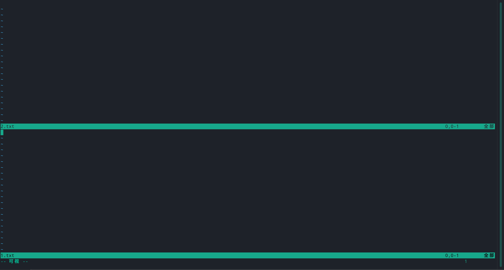

# vim 常用命令

## 指令模式( command line)

- [x] **移动光标方向**

  上下左右移动：

  > - `h`或者左方向键左移，`j`或者上方向键上移，`k`或者下方向键下移，`l`或者右方向键右移动；想要在一个方向上移动多行的话，是数字加上`h`，`j`，`k`，`l`。
  > - `-` 和 `+` 代表移动到非空白字符的上一列和下一列；
  > - `0`和`$`代表移动到这一列的第一个和最后一个字符；
  > - `n + <space>` 代表向右移动`n`个字符；
  > - `n + <enter>` 表示向下移动`n`行；
  > - `L`表示移动到屏幕显示的最后一列的第一个字符上面；`G`表示移动到最后一列，`nG`表示移动到这个文件的第`n`列；`gg`表示移动到第一列，相当于`1G`；

- [x] 字符串匹配

  搜索字符串：

  > - `/word` 表示向下搜索字符串`word`；
  > - `？word` 表示向上搜索字符串`word`；
  > - `n` 表示重复上一次的搜索，`N`表示反向执行上一次的搜索。
  
  搜索和替换字符串：
  
  > - `:n1,n2s/word1/word2/g`从`n1`行到`n2`行，替换`word`为`word2`；
  > - `:1,$/word1/word2/g`从头到尾替换`word1`为`word2`；
  > - `:1,$/word1/word2/gc`从头到尾替换`word1`为`word2`，替换时确认；

- [x] 删除字符：

  > - `x`向后删除一个字符，`X`向前删除一个字符；`nx`表示向后删除`n`个字符。
  >
  > - `dd`删除光标所在的一整行；`ndd`表示向下删除`n`行；
  >
  > - `d1G`表示删除从当前光标开始到文件开头的所有数据；`dG`表示删除从当前光标开始到文件末尾的所有字符；
  >
  > - `d$`表示删除从光标处到行尾的所有字符，`d1`表示删除从光标处到行首的所有字符
  >

- [x] 复制字符：

  > - `yy`表示复制一整行，`nyy`表示向下复制`n`行，`y1G`和`yG`分别表示复制光标处到文件开头的内容和光标处到文件末尾的内容；`y1`表示复制光标处到行首的内容，`y$`表示复制光标处到行尾的内容

- [x] 其他操作：

  > - `ZZ` 如果文件没有改动则不保存离开，佛祖额保存离开；
  >
  > - `:w filename`将内容保存为`filename`；
  >
  > - `：r filename`将`filename`中的内容添加到光标显示的后面；
  >
  > - `: n1, n2 w filename` 将从`n1`行到`n2`行的内容保存到文件`filename`中；
  >
  > - `!command`在终端中执行命令`command`
  >

## 区块选择

在命令行模式中进入区块选择模式的方法：

|    命令    | 含义                         |
| :--------: | ---------------------------- |
|    `v`     | 会将光标经过的地方反白选择； |
|    `V`     | 会将光标经过的行反白选择；   |
| `ctrl`+`v` | 以矩形的方式选择数据；       |
|    `y`     | 复制选择的地方；             |
|    `d`     | 删除选择的地方；             |
|    `p`     | 将复制到的内容粘贴到光标处； |

## 多文件编辑和多窗口

可以通过执行`vim file1 file2`同时打开多个文件；

常用命令有：

|   命令   | 含义                   |
| :------: | ---------------------- |
|   `:n`   | 编辑下一个文件         |
|   `N`    | 编辑上一个文件         |
| `:files` | 列出当前打开的所有文件 |

输入`:sp`打开多窗口模式，或者`:sp filename`打开新的文件；

常用的命令有：

| 命令                                    | 含义                                         |
| --------------------------------------- | -------------------------------------------- |
| `:sp [filename]`                        | 分割窗口，打开当前文件或者新的文件`filename` |
| `ctrl` + `w` -> `ctrl` + `j`/`下方向键` | 光标移动到下方的窗口；                       |
| `ctrl` + `w` -> `ctrl` + `k`/`上方向键` | 光标移动到上方的窗口；                       |
| `ctrl` + `w` -> `q`                     | 推出当前窗口；                               |

## 关键字补齐功能

`ctrl` + `x` -> `ctrl` + `o` 